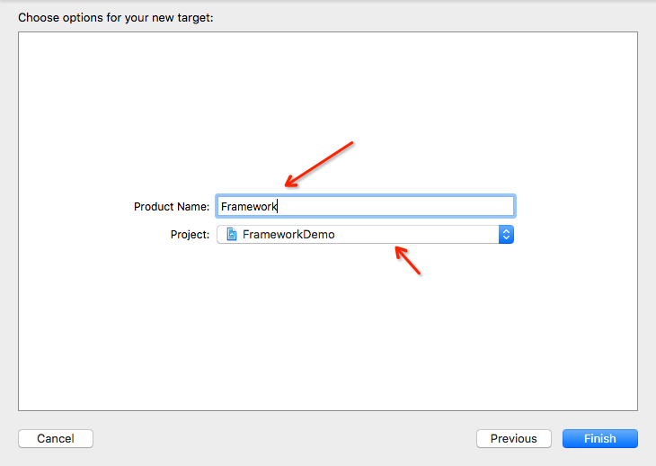
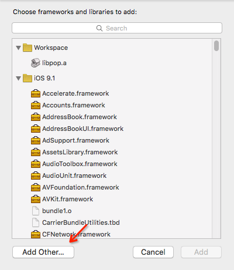

# 制作静态Framework
## 开始

随着时间的积累，我们肯定会有大量的可共用代码。如果我们想将这些公用代码在大量项目中使用或者与别人分享。一种方法是直接提供源代码文件，然而，这种方法很不优雅。我们不仅暴露了源码的实现细节，而且植入的方式很不简洁。

另一种方法是静态库（.a文件），这种方式虽然解决了源码的暴露问题，但是你也必须一并公布所有的公开的头文件，实在是非常的不方便。

我们需要一种简单的方法来编译代码，这种方法必须使得你的代码易于分享，并且易于移植。正如题目，Framework呼吁而出。


## 什么是Framework
Framework可以理解为一个资源的集合（文件夹），将静态库和其头文件包含在其中，可以在Xcode中方便的使用它。

在OS X上，可能会创建一个[动态连接](https://developer.apple.com/library/mac/documentation/MacOSX/Conceptual/BPFrameworks/Concepts/FrameworkBinding.html)的framework。通过动态连接，framework可以热更新，不需要重新连接，并且在运行时大部分代码是共享出来，大大减少了内存消耗，提高了系统的性能。

在iOS8之后才准许开发者使用第三方动态库，这里我们不会讲动态库，[这里有很好的说明](http://foggry.com/blog/2014/06/12/wwdc2014zhi-iosshi-yong-dong-tai-ku/)。这里我们还是从如何制作静态的Framwork来讲起。

## 创建Framework
我们以FrameworkDemo的项目为例。

#### Step 1 创建一个空的视图工程。


我们不是创建静态库嘛，为什么是一个视图工程？向下看吧。

### Step 2 创建静态Framework
#### Step 2.1 添加一个新的target

#### step 2.2 以工程名添加bundle


正如前面所说framework可以理解为一个资源的结合，而bundle正好满足这方面的要求。这里需要将bundle Extension更改成framework。

**注意：再创建bundle之前我们需要先将之前创建的FrameworkDemo的target更改下名字，为了避免与framework名字冲突，这里更改成FrameworkDemoTest。**
这样我们就有了如下的4个target。

前面三个targets用于Demo和单元测试。最后的FrameworkDemo就是我们需要的静态framework。但是现在还不能够使用。

#### Step 2.3 修改Bundle的属性
如上图在target中选择FrameworkDemo。
#### Step 2.4 FrameworkDemo:选择Build Settings->->  Architectures -> Base SDK  改为Latest iOS(iOS9.1)

#### Step 2.5 FrameworkDemo:在Deployment下，
* 确保"OS X Deployment Target"指向最新的os x
将“Targeted Device。
* Family”更改成“1、2”，意思表明是iPhone/iPad。
* 将"iOS Deployment Traget"，更改成"iOS 7.0", 表明静态库支持7.0以上版本。


#### Step 2.6 因为创建的framework是供其他人使用，最好禁掉以下的功能（无效代码和Debug符号），让用户自己选择对自己项目有利的部分。
* Dead Code Stripping设置为NO
* Strip Debug Symbol During Copy 设置为NO
* Strip Style设置为Non-Global Symbols
* Mac-O Type设置为Relocatable Object File，选择生成文件格式


#### Step 2.7 如果在[Step 2.2](./zhi_zuo_framework.md#step-22-以工程名添加bundle)中没有设置Bundle Extension为framework，可以在Packaing中，将"Wrapper Extention"改为"framework"。

#### Step 2.8 在 info标签中，将“Bundle OS Type Code” 改为 “FMWK”（Framework ）

#### Step 2.9 在Build Phases标签，加入Copy Headers，用于公开发布头文件。

添加完成后会出现Public、Private和Project。

**注意：**这三个组中Public是你期望公布出去的头文件，Private下的头文件依然是可以暴露出来的，而Project下的头文件对于你的工程来说才是“私有”的，因此应该尽量将头文件加入Public或者Project下面。

#### Step 3 管理项目Target


如上图FrameworkDemoTest是测试app，FrameworkDemo是我们需要生成静态Framework。


在Products下面就是我们run后生成的文件，现在红色表明没有生成。

接下来我们来给我们的framework添加共享代码，这边添加Test类为例。
* 创建Test类


**注意：**targets选择的是FrameworkDemo。

* 公布Test头文件
 
我们不仅可以在[build-phases](./zhi_zuo_framework.md#step-29-在build-phases标签加入copy-headers用于公开发布头文件)中选择头文件，还可以在辅助面板中直接选择公布的属性。


* 添加代码

Test.h
```
@interface Test : NSObject

+ (void)testSuccess;

@end

```
Test.m
```
@implementation Test

+ (void)testSuccess {
    NSLog(@"Hello world, FrameworkDemo");
}

@end

```
到此，前期的准备工作已经完成，我们可以选择我们需要编译的版本，command+R运行获得Product。


如图我们可以清楚的看到生成的framework的目录下包含FrameworkDemo静态库（.a）和Headers公布的头文件目录。

## 如何使用Framework
在FrameworkDemoTest.app中我们可以编写示例代码，如图，我们在ViewController中使用了刚刚编写的Test类。

但是很不幸的是运行，报错了。
```
Undefined symbols for architecture i386:
  "_OBJC_CLASS_$_Test", referenced from:
      objc-class-ref in ViewController.o
ld: symbol(s) not found for architecture i386
clang: error: linker command failed with exit code 1 (use -v to see invocation)

```
原因是因为我们没有将生成的Framework添加到Demo项目中。

很简单，将之前我们生成的FrameworkDemo.framework直接拖到项目中。


再次运行我们可以看到控制台中输出Hello world, FrameworkDemo。 


**我们成功啦！**

## 如何在Framework中使用第三方库（使用Cocoapods）
编写项目库，正如开发项目一样，难免会应用第三方代码。而我们如何来引入第三方代码呢？
* 直接导入第三方代码，这种方式很不美观，我们不仅得当成自己的代码维护，而且还的管理它们的更新。
* [Cocoapods](https://cocoapods.org/)给我们带来另一种，把我们从第三方代码的管理中解脱出来，事实上这个也是现有iOS开发中使用最多的项目依赖管理方式。

问题来，我们如何在编写静态Framework时使用Cocoapods呢？那么跟着教程来吧。

#### Step 1 在项目目录下添加Podfile文件


Podfile的内容
```
workspace ‘FrameworkDemo’
xcodeproj ‘FrameworkDemo.xcodeproj'

link_with 'FrameworkDemoTest'

#install pop for animation
pod 'pop'

```
我们使用了第三方库[pop](https://github.com/facebook/pop)。

#### Step 2 在终端中cd到项目目录，执行pod install命令，来重新构建我们的项目。


#### Step 3 打开pod生成的FrameworkDemo.xcworkspace，我们可以看到pop库已经注入到我们的项目中。


#### Step 4 在Test类添加pop的代码。
Test.h
```
#import <UIKit/UIKit.h>
@class POPAnimation;

/**
 @author XuanPeng, 15-12-14 13:12:23
 
 动画结束时的block
 
 @param anim     实现的动画
 @param finished 是否结束
 */
typedef void (^AMAnimationCompletionBlock)(POPAnimation *anim, BOOL finished);

@interface Test : NSObject
/**
 @author XuanPeng, 15-12-14 13:12:47
 
 显示透明动画
 
 @param view      需要执行的view
 @param fromValue 开始值
 @param toValue   结束值
 @param duration  动画时间
 @param key       实现动画的key
 @param block     结束的block
 */
+ (void)alphaAnimationWithView:(UIView*)view fromValue:(id)fromValue toValue:(id)toValue
                      duration:(CGFloat)duration forKey:(NSString*)key
               completionBlock:(AMAnimationCompletionBlock)block;


@end

```

Test.m
```
#import "POP.h"

@implementation Test

+ (void)alphaAnimationWithView:(UIView*)view fromValue:(id)fromValue toValue:(id)toValue
                      duration:(CGFloat)duration forKey:(NSString*)key
               completionBlock:(AMAnimationCompletionBlock)block {
    POPBasicAnimation *animation = [POPBasicAnimation animationWithPropertyNamed:kPOPViewAlpha];
    if (fromValue != nil) {
        animation.fromValue = fromValue;
    }
    if (toValue != nil) {
        animation.toValue = toValue;
    }
    animation.timingFunction = [CAMediaTimingFunction functionWithName:kCAMediaTimingFunctionEaseInEaseOut];
    animation.duration = duration;
    animation.completionBlock = block;
    [view pop_addAnimation:animation forKey:key];
}

@end
```

我们添加了一个执行透明动画的函数，但是很不幸的是报错了。
错误主要原因是```POP.h file not found```。 我们不是加入了依赖嘛，怎么还会出现引用不到头文件的错误呢？
咱们可以回过头看下Podfile文件内这句```link_with 'FrameworkDemoTest'```，我们只是给FrameworkDemoTest.app加入了依赖项，也就是FrameworkDemo.framework没有加入。那我们是不是更改成
```link_with 'FrameworkDemoTest', 'FrameworkDemo'```就OK了嘛？当然不是啦，因为外部.a文件不能添加到framework中。那如何做呢？

** 解决编写framework中引用Pod内项目问题？**

* 解决方法： 在FrameworkDemo的target的Build Settings中添加Header Search Paths 为$(SRCROOT)/Pods,注意将后面的属性选择成recursive。


* 解决原因：竟然不能将第三方的.a文件打入framework中，那我们完全可以将这些依赖项让需要使用framework的工程来管理，就想我们这里将pod的依赖关联到FrameworkDemoTest而不是FrameworkDemo，我们仅仅只要将使用的第三方库的列表公布出去。那如何来引用第三方库的头文件呢？我们这边只需要配置一下FrameworkDemo的头文件搜索路径就可以了。
* 说明：在配置头文件搜索路径时，我们配置的是Header Search Paths而不是User Header Search Paths，因为一些第三方库内的头文件引用会如这样```#import <pop/POPDefines.h>```，而不是以""号的方式来引用的。其次，我们还要确保配置的头文件路径必须包含内部的子文件夹的路径，那么需要路径的属性选择成recursive用来包含子文件夹。

到这里Cocoapods的依赖问题解决了，我们在FrameworkDemoTest中使用我们刚刚封装的pop动画。

## 多架构编译

实际开发app时，我们需要在不同的CPU架构下运行：
* arm7: 在支持iOS7之前的设备上使用
* arm7s: 在iPhone5和iPhone5C上使用
* arm64: 在iPhone5S以上的64位ARM处理器上使用
* i386: 在32位模拟器上使用
* x86_64: 在64位模拟器上使用

这意味着我们提供的framework必须支持以上所有的CPU架构。```lipo -info xxx```这个命令能打印出framework中的静态库文件（.a）支持的CPU架构。
那么我们cd到之前编译的FrameworkDemo.framework的文件夹中，执行上面命令看看。


正如图，我们这个版本只能支持在32位模拟器上使用，那么我们必须提供多个不同版本的framework嘛？
不需要，通过```lipo```命令我们能够将两个不同架构的.a文件合并成一个支持多个架构的静态库文件。那么接下来让我们一步一步来吧。

#### Step1 创建一个新的target


为什么是Aggregate？因为我们这边只是需要将之前生成的framework合并一个多架构的framework，不需要生成新的product。

#### Step2 新的target取名为Framework


#### Step3 添加运行Shell脚本


#### Step4 添加脚本代码


脚本代码：
```
#!/bin/sh

UNIVERSAL_OUTPUTFOLDER=../build/

# make the output directory and delete the framework directory
mkdir -p "${UNIVERSAL_OUTPUTFOLDER}"
rm -rf "${UNIVERSAL_OUTPUTFOLDER}/${PROJECT_NAME}.framework"

# Step 1. Build Device and Simulator versions
xcodebuild -target "${PROJECT_NAME}" ONLY_ACTIVE_ARCH=NO -configuration ${CONFIGURATION} -sdk iphoneos  BUILD_DIR="${BUILD_DIR}" BUILD_ROOT="${BUILD_ROOT}" clean build
xcodebuild -target "${PROJECT_NAME}" ONLY_ACTIVE_ARCH=NO -configuration ${CONFIGURATION} -sdk iphonesimulator BUILD_DIR="${BUILD_DIR}" BUILD_ROOT="${BUILD_ROOT}" clean build

# Step 2. Copy the framework structure to the universal folder
cp -R "${BUILD_DIR}/${CONFIGURATION}-iphoneos/${PROJECT_NAME}.framework" "${UNIVERSAL_OUTPUTFOLDER}/"

# Step 4. Create universal binary file using lipo and place the combined executable in the copied framework directory
lipo -create -output "${UNIVERSAL_OUTPUTFOLDER}/${PROJECT_NAME}.framework/${PROJECT_NAME}" "${BUILD_DIR}/${CONFIGURATION}-iphonesimulator/${PROJECT_NAME}.framework/${PROJECT_NAME}" "${BUILD_DIR}/${CONFIGURATION}-iphoneos/${PROJECT_NAME}.framework/${PROJECT_NAME}"
```
在脚本中我们先用```xcodebuild```命令将多个架构的framework文件编译出来，然后将这些framework文件复制到之前定义的```UNIVERSAL_OUTPUTFOLDER```路径下，最后执行```lipo```命令将多个framework合并成一个多架构的framework。

OK，到这里我们可以编译这个Framework target，编译成功后会在项目文件夹内多了build文件夹，而build文件夹内就是我们生成的支持多架构的framework。


在终端中cd到这个framework目录下，在执行```lipo -info xx```，如果以支持多个架构，当然这个才是我们可以最终提供给其他人使用的framework。


#### Step4 测试项目更改（FrameworkDemoTest）
* 在FrameworkDemoTest target中，添加Framework的依赖，这样可以直接编译FrameworkDemoTest的同时编译Framework target，这样能保证使用的是最新的framework。


* 不要忘记将之前引入的FrameworkDemo.framework删除掉，重新添加我们新生成的支持多架构的framework。

**这里有个技巧，直接添加build路径下的framework，因为这个路径下的framework是实时更新的。**




**再次提醒Add Other... 中选择刚刚生成的build路径下的framework**

## 打包资源
开始增加难度，准备在framework中实现一个带xib的TestViewController，将头文件对外公布。


在FrameworkDemo项目中直接push进TestViewController，添加代码如下：

```
    TestViewController *viewController = [[TestViewController alloc] initWithNibName:@"TestViewController" bundle:nil];

    [self.navigationController pushViewController:viewController animated:true];
```
运行代码，结果crash。
```
*** Terminating app due to uncaught exception 'NSInternalInconsistencyException', reason: 'Could not load NIB in bundle: 'NSBundle </var/mobile/Containers/Bundle/Application/9759BC38-BFA5-4379-A4A7-3D7C1BFD4674/FrameworkDemoTest.app> (loaded)' with name 'TestViewController''

```
原因很明显找不到xib文件。那么问题来了，我们已经实现了TestViewController.xib文件，为什么还是找不到呢？如何解决这个问题？

先来说说第一个问题，Xcode build项目时是将xib文件当成资源文件进行编译打包到app安装包内。注意：TestViewController.xib现在是在FrameworkDemo.framework项目内，可悲的是framework内不能打包进资源文件。也就是FrameworkDemo.framework内根本就没有这个xib文件，最终导致外部使用这个TestViewController时会crash报错（或者直接黑屏）。

如何解决？再次使用bundle文件，将我们的xib文件打包到bundle文件内导出和FrameworkDemo.framework一起使用。具体步骤如下：

#### Step 1 在项目中创建新的target FrameworkDemoResource.bundle


#### Step 2 将xib文件添加进FrameworkDemoResource.bundle内


#### Step 3 修改FrameworkDemoResource.bundle内的文件仅供iOS使用


**以上资源打包文件就已经创建好了，接下来我们讲讲一些编译技巧和如何使用？**

#### Step 4


